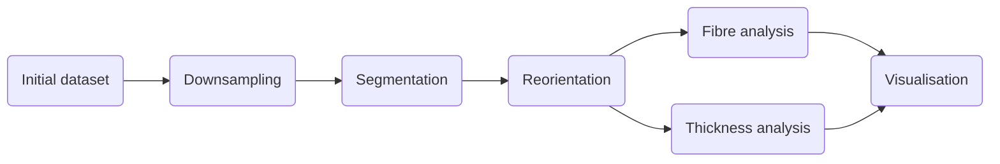

# $\mu$CT analysis
## General information
This repository contains code to analyse $\mu$CT datasets of rat uteri. 

## Requirements
The code was run on Linux Ubuntu 22.01 using MATLAB (Mathworks) version 2022a and Python version 3.9
The required packages for Python are found in requirements.txt
The project uses [TOML](https://toml.io/en/) files for configuration.

## Pipeline
The following diagram presents the main steps of the project. 


## Data folder structure
The folders that contain the data are structured in the following way:
```bash
data
├── AWA015_PTA_1_Rec_Trans
│   └── downsampled
│       ├── muscle_segmentation
│       │   ├── left
│       │   └── right
│       └── ST
│           ├── binary
│           ├── extrapolated
│           ├── mask
│           └── masked
```

## Data availability
The $\mu$CT data that has been used is available [here](https://figshare.com/) TODO add link when finished

