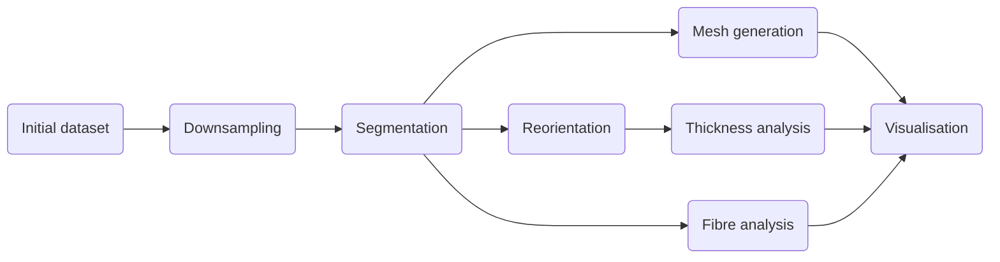

# uCT analysis
## General description
This repository contains code to analyse uCT datasets of rat uteri and used for the paper
__3D virtual histology of the rat uterus musculature using micro-computed tomography__

## Requirements
The code was run on Linux Ubuntu 22.04.2 LTS\
The code was developed in [MATLAB](https://www.mathworks.com/products/matlab.html) version 2022a and [Python](https://www.python.org/) version 3.10.6\
The visualisation was done in [cmgui](https://www.cmiss.org/cmgui/)\
The required packages for Python are found in requirements.txt\
This project uses [TOML](https://toml.io/en/) files for configuration.

## Workflow
The following diagram presents the workflow of the project:


## Data folder structure
The folders that contain the data are structured in the following way:
```bash
data
├── AWA015_PTA_1_Rec_Trans
│   └── downsampled
│       ├── muscle_segmentation
│       │   ├── left
│       │   └── right
│       └── ST
│           ├── binary
│           ├── extrapolated
│           ├── mask
│           └── masked
```
Configuration files should have the same name as the dataset and be placed in the data folders.\
There is one configuration file for the main dataset (AWA015_PTA_1_Rec_Trans.toml) and one for the 
downsampled dataset (AWA015_PTA_1_Rec_Trans_downsampled.toml). The configuration files used in this
project are placed in the config folder.

## Usage
The main scripts used in this project are contained in the m_scripts folder for the MATLAB code and in the p_scripts for the Python code.

### Setup 
Install the Python packages and add the location of the code to your PYTHONPATH by running the setup
script:
```bash
./setup
```

In MATLAB, add the code folder and subfolders to the MATLAB search path.

The subfolders of the data folder are not automatically generated; thus, they have to be created beforehand
following the structure presented in the previous section.

The MATLAB and Python scripts use a base directory which is the path to the microCT folder from $HOME.
The default path is Documents/phd. The base directory can be changed for the MATLAB scripts by editing 
the __baseDir.m__ function and for the Python scripts by editing the BASE variable in the __utils.py__
 file. Both of these files are located in the utils folder. 

### Downsampling
The image of the original uCT dataset can be downsampled using the __downsampledMicroCTDataset.m__ script 
located in the m_scripts folder. The numbers of the first and last images to be downsampled are specified
in the configuration file. The downsampled images will be saved in the downsampled folder.\
The images can either be downsampled by a given factor, or the new resolutions for each axis can be 
provided as a 3D vector [x y z].

### Segmentation
The image of the downsampled or original dataset can be segmented with the __segmentMicroCTDataset.m__
script located in the m_scripts folder. There are four types of segmentation possible: fat, tissue,
shape, and muscle. The segmentation masks are saved in different folders depending on the chosen type.
For example, the muscle segmentation masks will be saved in the muscle_segmentation folder, and the
tissue segmentation masks will be saved in the tissue_segmentation folder. The parameters for the 
segmentation script are set in the configuration file.

The segmentation masks and uCT images can be converted to a 
[NIfTI](https://nifti.nimh.nih.gov/nifti-2/) archive with the __nifti-converter.py__ script located in the
 p_scripts folder. To see the arguments and options of the script, use the --help flag:
```bash
python3 nifti-converter.py --help
```
The NIfTI archive can be read by software such as [ITK-SNAP](http://www.itksnap.org/pmwiki/pmwiki.php) to
 edit the segmentation masks. The edited masks can be exported with the __readNiftiSegmentation.m__
script located in the utils folder. This script requires that the uCT images and the segmentations be 
located in the same folder.

### Analysis
The analysis requires muscle segmentation masks.

#### Thickness analysis
If the uCT images do not slice the uterine horns perpendicularly, the segmentation masks can be reoriented
to align each horn with the z-axis. The __uCTRotation.m__ script located in the m_scripts folder rotates
the left and right horns. The rotated images of each horn are saved in their respective folders. The number
of the first and last images to be rotated can be chosen in the configuration file in case some slices are
already aligned with the z-axis.

Before calculating the muscle wall thickness, the centreline of each horn must be computed with the
__uCTCenterline.m__ script located in the m_scripts folder. The region argument determines which 
segmentation masks are loaded. If "left", "right", or ["left", "right"] are specified, the rotated masks
located in either the left or right folder are used. If "both" is specified, the non-rotated segmentation
masks are used.

Once the centrelines are generated, the muscle wall thickness can be calculated with the 
__uCT-analysis.py__ script located in the p_scripts folder. To see the arguments and options of the 
script, use the --help flag:
```bash
python3 uCT-analysis.py --help
```
The average thickness for each horn will be displayed on the terminal. The plot of the thickness 
variations and the plots of the angular thickness of the __4__ slices selected in the configuration file
will be displayed. The angular and average thicknesses will be saved in the muscle_segmentation folder.

#### Fibre analysis
The muscle fibres can be extracted from the muscle segmentation masks. The __STPipeline.m__ script
located in the m_scripts folder finds the fibres using structure tensors. This script requires that the
segmentation masks and the masked uCT images be placed in the ST/mask and ST/masked folders, respectively.
The masks can be applied either by specifying the paths to the masks in the __loadImageStack.m__ function
 located in the utils folder or with the __readNiftiSegmentation.m__ function. They can then be saved
with the __saveImageStack.m__ function located in the utils folder.\

The fibres will be annotated based on the angle relative to the centreline of each horn found in the 
centreline.mat file created with the __uCTCentreline.m__ script. If no centreline is provided, the slices
are assumed to be aligned with the z-axis and the fibres are annotated based on the angle relative to the
vector [0 0 1].

The __STPipeline.m__ script will generate .exnode and .exelem files that can be visualised in cmgui. The
parameters for the script can be set in the configuration file.

This code was written by Mark Trew.

#### Mesh generation
The segmentation masks can be used to generate a surface mesh with software such as 
[ITK-SNAP](http://www.itksnap.org/pmwiki/pmwiki.php). The __mesh-annotation.py__ script annotated a mesh
(surface or volumetric) with the thickness data calculated previously. To see the arguments and options 
of the script, use the --help flag:
```bash
python3 mesh-annotation.py --help
```
The supported file types for the mesh are .vtk, and .vtu.

The __mesh-converter.py__ script converts a mesh (surface or volumetric) to .exnode and .exelem files to
be visualised in cmgui. The mesh can be annotated with the thickness information. 
To see the arguments and options of the script, use the --help flag:
```bash
python3 mesh-converter.py --help
```
The supported file types for the mesh are .vtk, and .vtu.

### Visualisation
To visualise the meshes and fibres in cmgui, com files are located in the com folder.\
Below is an example of a figure generated for the article using the 
AWA015_PTA_1_Rec_Trans_fibre_mesh.com (A) and the AWA015_PTA_2_Ova_Rec_Trans_L4_fibres.com (B) com files,
which overlays the fibres found in the uterus on the surface mesh and shows the fibres in a smaller section
of the uterus located near the ovaries.
 and the AWA015_PTA_2_Ova_Rec_Trans_L4_fibres.com (B) com files")

Below is an example of a figure generated for the article using the 
AWA015_PTA_1_Rec_Trans_thickness_mesh.com (A) and the AWA015_PTA_2_Ova_Rec_Trans_thickness_mesh.com (B) 
com files which show the thickness of the muscle layers in the uterus.
 and the AWA015_PTA_2_Ova_Rec_Trans_thickness_mesh.com (B) 
com files.")

## Data availability
The uCT dataset used and the meshes generated are available [here](https://figshare.com/).
